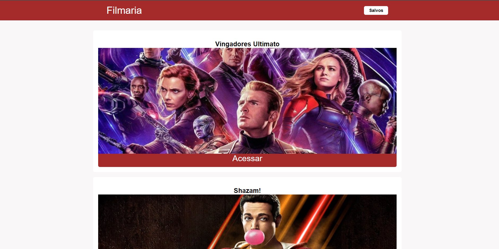

<p align="center" fontSize="60px">
  Filmaria
</p>

<p align="center">
  
</p>

## 💻 Projeto

Desenvolver uma plataforma web para listagem de filmes disponível no curso Sujeito Programador: [API]](https://sujeitoprogramador.com/r-api/?api=filmes).

### Funcionalidades

- [x] **Listar filmes**: Listar os filmes em tela.

- [x] **Acessar detalhes sobre o filme**: Criar página para acessar os detalhes do filme.

- [x] **Acessar trailer do filme**: Dentro da página de detalhes sobre o filme podemos acessar o button Trailer e ser redirecionado para o trailer do filme no youtube.

- [x] **Favoritar filmes**: Dentro da página de detalhes sobre o filme podemos favoritá-lo.

- [x] **Listar filmes favoritos**: Criar página de filmes favoritos, onde aqueles que o usuário favoritou serão listados.


### Conceitos abordados

- Consumo de api com o uso da lib [axios](https://github.com/axios/axios).

- Uso de flexbox para alinhar e ajustar elementos na página.

- Controle de paginação na listagem.

- Componentização.

- CSS global.

## :rocket: Tecnologias

-  [Vue](https://vuejs.org/guide/introduction.html)
-  [Vue Router](https://router.vuejs.org/)
-  [Axios](https://github.com/axios/axios)

## 📥 Instalação e execução

Faça um clone desse repositório e acesse o diretório.

```bash
# Instalando as dependências
$ yarn

# Executanto aplicação
$ yarn start

```

## :muscle: Contribuir ao projeto

Faça o `fork` e clone o projeto a partir do seu usuário.

```bash
# Clonando projeto
$ git clone https://github.com/SEU-NOME-DE-USUARIO/projeto-filmaria-vue.git

# Criando um branch
$ git branch minha-alteracao

# Acessando o novo branch
$ git checkout -b minha-alteracao

# Adicionando os arquivos alterados
$ git add .

# Criando commit e a mensagem
$ git commit -m "descrição da correção...."

# Enviando alterações para o brach
$ git push origin minha-alteracao
```
Você deve navegar até o seu repositório onde fez o fork e clicar no botão *New pull request* no lado esquerdo da página.

